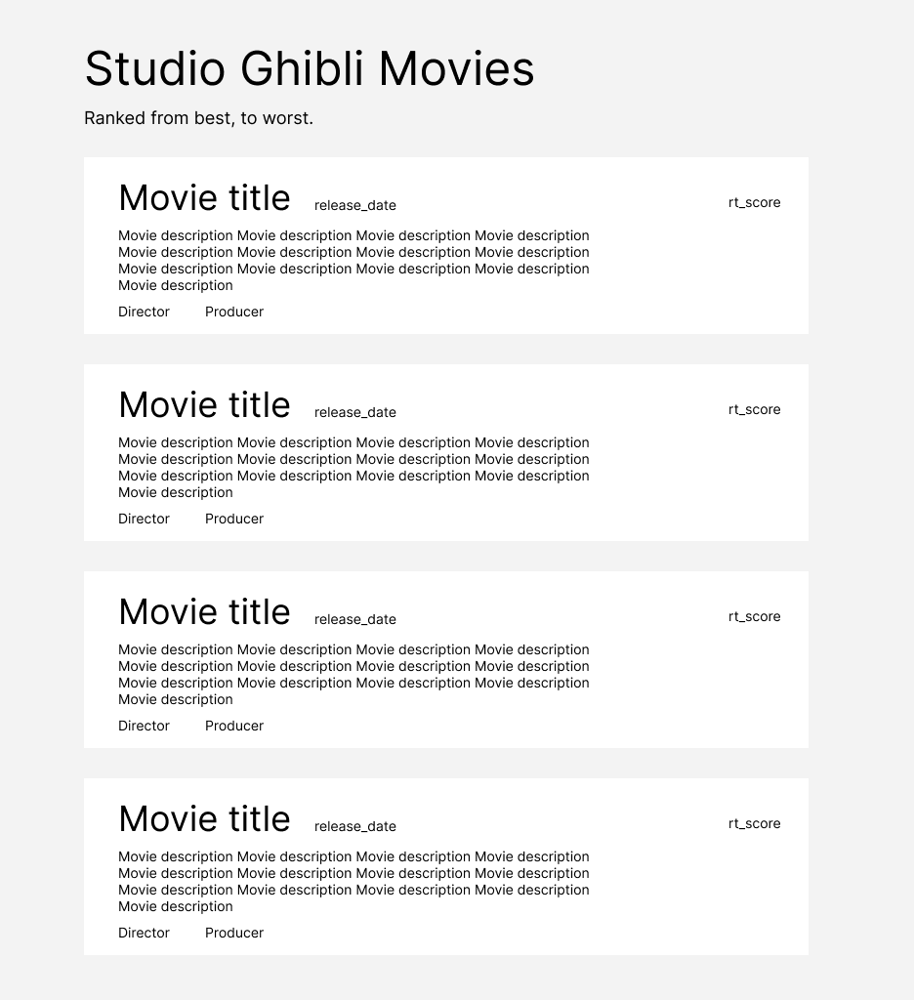

# WKP9

Hey team!
After a major graded project, let's do something different, and a little bit more straightforward.
Today we’re going to build a list of the Studio Ghibli Movies, ranked from best to worst. If you haven’t seen any of those, I suggest you to look on the Onja hard drive! (after completing the project of course). They are amazing ✨

The website will look similar to this :

You will fetch the data from this URL [https://ghibliapi.herokuapp.com/films](https://ghibliapi.herokuapp.com/films)

and display the result in the HTML. The film needs to be sorted depending on their rt_score!

There is a lot of data in a film object, use whatever attribute you need.

Feel free to add some beautiful styling to your website when you're done fetching and sorting the data.

Good luck 💻

## Report about the project: 

1. In a few sentences, explain the structure of your project.

### Project structure: 
 - First of all, I need to fetch the data from a specific movie url
 - I need to create an html and add it in the dom
 - Then I need to sort it by the best to the worst based on their score rate.

2. If you had more time, what area of your project would you improve?
3. Did you learn anything new while working on this project?

### Something I have learnt well doing this projject:

 - I learn how to filter element
 - Also reset the list after filtering it

4. What was the most challenging part for you?

### Most challenging part:

 - I found it a bit challenging to filter the list and the reset it after filtering but a last I got it work.

5. Would you like a new explanation about a specific topic?
6. Any other comments?
### Another comments:
 - I can say that I finished everuthing that's been asked. This is my first day finishing the project till the end.
 - I create a search input to filter the movie we searched from the list by searching their title.

